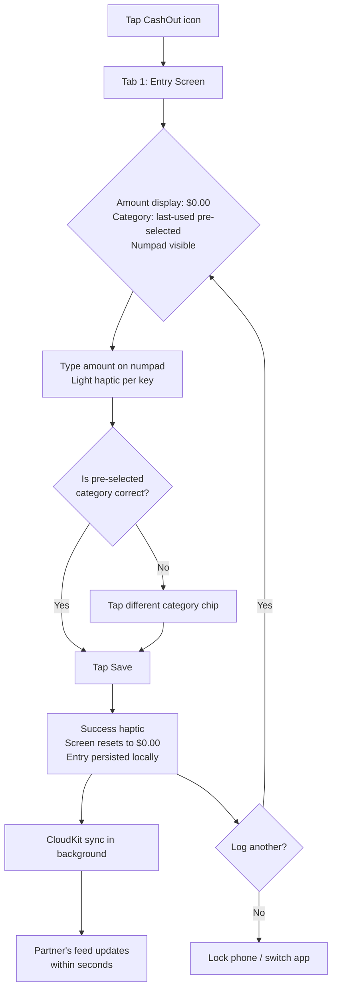
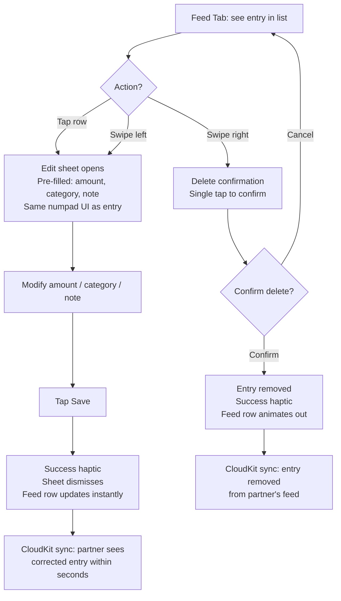
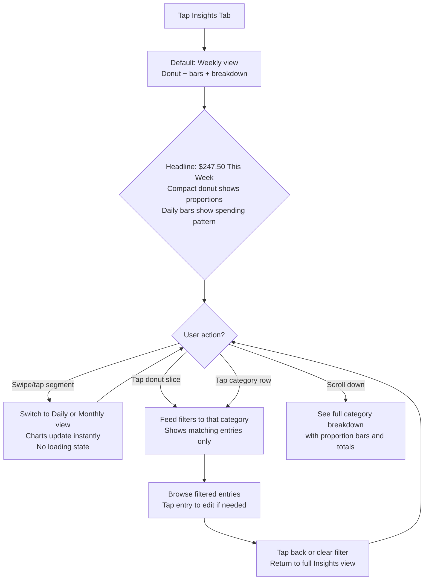
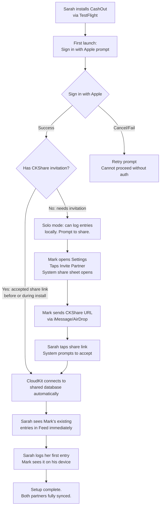
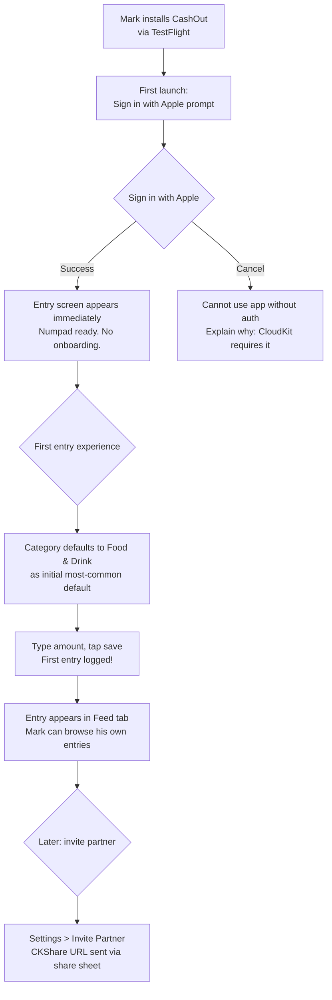

# UX Design Specification CashOut

**Author:** Boss
**Date:** 2026-03-27

---

## Executive Summary

### Project Vision

CashOut is a purpose-built iOS app that makes cash spending visible between two partners — instantly. The product thesis is speed: an amount-first expense entry flow completable in under 5 seconds, with real-time shared visibility via CloudKit. It solves one specific problem — "we don't know where our cash goes" — for exactly two users. Narrowness is the moat. Every design decision serves entry speed, shared visibility, or spending insight. Nothing else ships.

### Target Users

Two specific people: the builder and his wife. Both are smartphone-native iOS users who use cash regularly for everyday purchases (food, parking, tips, small buys). They value simplicity over feature depth, want financial transparency without friction, and have no interest in budgeting philosophies or bank-linked tools. Tech-savvy enough for TestFlight, but the app must feel like it requires zero learning.

### Key Design Challenges

1. **The 5-second constraint** — Entry speed is a hard design principle, not an aspiration. Research confirms numpad-first (amount before category) with smart defaults (most-recently-used category) is the fastest pattern. One unnecessary tap breaks the contract.
2. **Entry vs. Insights navigation** — The app opens to entry (primary action), but insights sustain the habit. iOS 26's tab bar with `.tabViewBottomAccessory` FAB provides a native solution: entry is always one tap away from any screen via the floating glass button.
3. **Invisible partner onboarding** — CloudKit CKShare URL (via AirDrop or iMessage) is the proven frictionless path. Email-based invite flows (Honeydue) are a known failure point. The second user must install, sign in with Apple, accept the share, and immediately see shared data.
4. **The 30-second window** — Apps users keep are fast enough to use in the moment of spending. Apps they abandon become "catch up at end of week" chores. Every interaction must target the 30 seconds after paying cash.

### Design Opportunities

1. **Radical simplicity** — Competitors drown users in features. CashOut's minimal UI is the brand. Fewer elements on screen = stronger differentiation and faster entry.
2. **Shared feed as behavior reinforcement** — Seeing a partner's entries appear in real-time creates a subtle accountability loop. The feed as a social-style timeline (with partner avatars, relative timestamps) turns expense logging into a shared act, not a solo chore.
3. **iOS 26 Liquid Glass native advantage** — Floating FAB via `.tabViewBottomAccessory`, morphing sheet transitions, auto-minimizing tab bar on scroll, and `.glassEffect()` controls. The app can feel more natively polished than any competitor by adopting the latest platform patterns with no backwards-compatibility baggage.
4. **Interactive insights as retention hook** — Donut chart for category breakdown + bar chart for weekly trends, with tap-to-filter interaction. Research shows interactive charts are the single highest-retention data feature in finance apps — they produce the "aha moment" that sustains the logging habit.

### Research-Informed Design Principles

| Principle | Source | Application |
|-----------|--------|-------------|
| Amount-first entry | Cashew, Daily Budget, Budget Flow patterns | Numpad visible on launch; category secondary with smart defaults |
| Numpad haptics | 2025 haptics research | Light haptic per key, success on save, error on validation |
| CKShare for pairing | Honeydue invite friction analysis | Share URL via AirDrop/iMessage, not email invite codes |
| Social-feed mental model | Honeydue, Zeta, Monarch patterns | Reverse-chronological, partner avatars, relative timestamps |
| Swipe gestures on feed | Monarch "swipe to review" pattern | Swipe-left to edit, swipe-right to delete |
| Donut + bar charts | Finance app data viz research | Category donut (home), weekly bar (scroll), tap-to-filter |
| iOS 26 FAB + glass | Apple WWDC25, Liquid Glass guidelines | `.tabViewBottomAccessory` with `.glassEffect(.regular.interactive())` |
| Widget quick-entry | Budget Flow, iOS 26 WidgetKit | Lock screen / home screen widget for zero-app-launch logging (v2) |

## Core User Experience

### Defining Experience

The atomic unit of value is logging a cash purchase. This action runs 3-8 times per day per person and must be completable in under 5 seconds from app open. The core loop is: spend cash → open app → enter amount → confirm category → save → partner sees it. If this loop isn't fast enough to execute while standing at a checkout or walking away from a purchase, nothing else in the app matters.

The entry flow follows an amount-first pattern (research-validated as the fastest approach): the numpad is visible immediately, the category defaults to most-recently-used, and save is a single tap. The user's first thought after paying is the number — not the category.

### Platform Strategy

- **Platform:** Native iOS 26+, SwiftUI only
- **Interaction context:** One-handed, standing, often in motion (just completed a cash purchase)
- **Offline:** Local-first persistence with background CloudKit sync. Fully functional for entry and viewing while offline
- **Device capabilities leveraged:**
  - Haptics — light feedback per numpad key, success on save
  - Face ID — instant unlock directly into the app
  - iOS 26 Liquid Glass — `.tabViewBottomAccessory` FAB with `.glassEffect(.regular.interactive())` for persistent entry access
  - Morphing sheet transitions — `navigationTransition(.zoom())` from FAB to entry sheet
  - Tab bar auto-minimize on scroll — `.tabBarMinimizeBehavior(.onScrollDown)` for full-screen feed experience
- **v2 platform opportunities:** Lock Screen interactive widget for zero-app-launch logging, Apple Watch entry

### Effortless Interactions

1. **Logging an expense** — Numpad visible immediately. No modals to dismiss, no screens to navigate past. Category defaults intelligently. Save is one tap. Target: 3 taps (amount keys + category confirm + save).
2. **Seeing partner activity** — Entries appear in the shared feed in real-time via CloudKit subscriptions. No pull-to-refresh, no sync button.
3. **Switching time views** — Daily/weekly/monthly via swipe or segmented control. No loading states, no transitions. Data is local-first, always available instantly.
4. **Partner joining** — Install → Sign in with Apple → accept CKShare link (via AirDrop/iMessage) → shared data immediately visible. Zero configuration screens.
5. **Editing a mistake** — Tap entry in feed → same numpad/category UI appears pre-filled → change value → save. Same speed as creating. Swipe-left on feed row as shortcut.

### Critical Success Moments

| Moment | Why It's Make-or-Break |
|--------|----------------------|
| First expense logged | If this takes > 5 seconds, the mental model becomes "this is slow" — and it never recovers |
| Partner's first entry appears | The "it works!" moment — shared visibility becomes real, not theoretical |
| First weekly summary viewed | The "aha moment" — spending patterns revealed. This sustains the logging habit |
| First edit/delete | Builds data trust — clunky corrections erode confidence in totals |
| 20th app open | Muscle memory forming — amount → save without conscious thought |

### Experience Principles

1. **Speed is the product** — If it's not fast, it doesn't ship. Every element on screen must justify its existence against the 5-second clock. The numpad is the hero, everything else is supporting cast.
2. **Amount-first, always** — The numpad is visible the moment you're ready to log. Category is secondary, defaulted intelligently, and changeable with one tap. Notes are optional and never in the way.
3. **Shared by default** — There is no "my data" vs. "our data." Every entry is household data from the moment it's saved. The feed is the shared truth. Partner attribution is visible but not emphasized.
4. **The app disappears** — The best interaction is the shortest one. Open, log, close. The app succeeds when users spend the least time in it. Insights are the exception — the reward for logging.
5. **Trust through correctness** — Edits and deletes must be as fast and obvious as creating. Untrusted data is useless data.

## Desired Emotional Response

### Primary Emotional Goals

CashOut's emotional design target is **utilitarian calm**. The app is a tool, not a companion. It does not celebrate, gamify, motivate, or express personality. The ideal emotional state during use is the same as locking the front door — a brief, automatic action that requires no emotional engagement.

- **During entry:** Nothing. Neutral. The interaction is so fast it doesn't register as an event. Like tapping a light switch.
- **During feed browsing:** Matter-of-fact. Data, not narrative. Partner entries appear with the same emotional weight as your own — just information, presented clearly.
- **During insights:** Calm observation. The numbers speak for themselves. No judgment, no nudges, no "you spent too much" framing. Just facts.

### Emotional Journey Mapping

| Stage | Target Emotion | Anti-Pattern to Avoid |
|-------|---------------|----------------------|
| App open | Nothing — instant, automatic | Splash screens, greetings, "welcome back" |
| Expense entry | Neutral efficiency — tap and done | Animations that celebrate saving, confetti, streaks |
| Feed viewing | Quiet awareness — just data | Social-media engagement tricks, emoji reactions |
| Insights | Calm clarity — "oh, that's where it went" | Judgment framing ("you overspent!"), color-coded warnings |
| Partner entry appears | Matter-of-fact — it's just there | Notification sounds, "Sarah just logged!", attention-seeking |
| Edit/delete | Confident correction — fix it, move on | "Are you sure?" anxiety, undo toasts that linger |
| Error/sync issue | Quiet reassurance — it'll resolve | Red alerts, exclamation marks, panic-inducing error UI |

### Micro-Emotions

**Critical positive micro-emotions:**
- **Confidence** — "I trust this data." Built through instant sync, easy corrections, and no lost entries.
- **Efficiency** — "That took no time." Built through the amount-first numpad, smart category defaults, and one-tap save.
- **Clarity** — "I can see where the money went." Built through clean category breakdowns and scannable totals.

**Critical negative micro-emotions to prevent:**
- **Guilt** — The app must never frame spending as good or bad. No red numbers, no warning thresholds, no "budget exceeded" language.
- **Surveillance anxiety** — Partner visibility should feel like shared awareness, not monitoring. No "your partner just viewed your entry" notifications.
- **Entry fatigue** — The moment logging feels like a chore, the habit dies. Speed is the antidote.

### Design Implications

| Emotional Goal | UX Design Approach |
|---------------|-------------------|
| Neutral entry | No animations on save beyond a subtle haptic. No "entry saved!" confirmation banner. The entry just appears in the feed. |
| Matter-of-fact feed | Partner entries styled identically to your own, differentiated only by a small initials badge. No special highlighting for "new" entries from partner. |
| Calm insights | Muted color palette for charts. No ranking language ("top category"), just totals. Donut chart slices use the same category colors as the feed — visual consistency, not drama. |
| Confident corrections | Edit flow pre-fills all fields. Delete requires one confirmation tap (not a modal dialog). Corrected entries sync silently. |
| No guilt framing | No red/green color coding for spending amounts. No comparisons to "targets" or "goals" (those are v2). Numbers are just numbers. |
| No surveillance feel | No "last active" indicators. No read receipts on entries. No "Sarah is viewing the feed" presence indicators. |

### Emotional Design Principles

1. **The app has no personality** — No mascot, no greeting, no tone of voice. UI copy is functional labels only ("Save", "Food & Drink", "This Week"). The brand is absence of friction, not presence of charm.
2. **Data without judgment** — Spending amounts are presented neutrally. No color coding implies good/bad. No language frames spending as positive or negative. The user decides what the numbers mean.
3. **Speed is the feeling** — The primary "emotion" is the absence of friction. Users should not consciously feel anything during entry — that's the success state. The moment they notice the UI, something is wrong.
4. **Shared, not surveilled** — Partner visibility is designed as mutual awareness, not accountability. The feed shows what was spent, not when it was viewed or by whom.
5. **The data sustains the habit** — Without gamification or streaks, the habit sustains because the data stays useful. When you stop logging, the "where did the money go?" blind spot returns. That absence — not an app reward — is the motivator.

## UX Pattern Analysis & Inspiration

### Inspiring Products Analysis

| App | Key UX Insight | Transferable Pattern |
|-----|---------------|---------------------|
| **Drafts** | Opens to blank input — no organization before capture | Numpad visible immediately on launch. Category deferred, not gated. |
| **Flighty** | Airport departure board mental model — data-dense but calm | Feed rows communicate amount, who, when, category at a glance. Color encodes identity, not judgment. |
| **Things 3** | Primary action reachable in 1-2 taps from anywhere | Add-expense accessible from any screen via floating glass button. |
| **Strong** | Stripped-down logging for 90-second gym windows | Entry screen shows only numpad + amount + category. Nothing else visible. |
| **Toshl Finance** | Numpad as the architectural hero of the UI | Generous key sizing, large amount display, number is the primary feedback. |
| **Gentler Streak** | Non-judgmental data — progress relative to self, not benchmarks | No red/green scoring. Muted palette. Data presented neutrally. |
| **Cupla** | Ambient awareness between two people — aligned, not merged | Shared feed framed as "we spent" not "you spent." Lightweight partner attribution. |
| **Copilot Money** | Native SwiftUI + local data = instant chart rendering | Swift Charts, local-first storage, no network round-trip for visualization. |

### Transferable UX Patterns

**Navigation Patterns:**
- **Numpad-as-home:** App opens directly to entry-ready state (Drafts blank canvas principle). No navigation required for the primary action.
- **Persistent floating entry point:** iOS 26 glass FAB ensures add-expense is one tap away from any screen (Things 3 one-tap principle).
- **Tab bar auto-minimize on scroll:** Feed and insights views use `.tabBarMinimizeBehavior(.onScrollDown)` for content-first experience.

**Interaction Patterns:**
- **Generous numpad targets with tap confirmation popups:** PCalc's key-tap popup confirms which key your finger obscured. No input lag — each keypress registers in under 16ms visually (PCalc, Toshl).
- **Swipe actions on feed rows:** Swipe-left to edit, swipe-right to delete with a satisfying snap (Monarch "swipe to review" pattern).
- **Haptic feedback per keypress:** Light haptic per numpad key, success on save. Synchronized exactly with visual feedback (Strong, PCalc).

**Visual Patterns:**
- **Departure board feed rows:** Each row shows amount (large), category icon + color, partner initials badge, relative timestamp. Scannable at a glance without reading (Flighty).
- **Summary-first, depth-on-demand:** One headline metric visible (today's total or this week's total), detailed breakdown one tap deeper (Apple Health, Copilot Money).
- **Dynamic Y-axis, no fixed thresholds:** Charts adjust range so the largest value fills the chart. No red budget ceiling lines (Apple Health HIG, Gentler Streak).

**Shared Experience Patterns:**
- **Ambient awareness, not surveillance:** Data is present for your benefit. No "partner viewed your entry" indicators. No per-person comparison totals displayed prominently (Cupla, Between).
- **"We" framing everywhere:** Feed header says "This Week" not "Your Spending." Entries are household events, not individual actions (Cupla, Honeydue).

### Anti-Patterns to Avoid

| Anti-Pattern | Why It Fails | CashOut Prevention |
|-------------|-------------|-------------------|
| **Setup Tax** | 68% of fintech users abandon during onboarding. Requiring budgets/categories/pairing before first entry kills adoption. | Allow immediate solo entry. Partner pairing enhances but never gates. |
| **Dashboard Saturation** | Showing balance + transactions + budget bars + trends on one screen creates cognitive overload. 80% of users need only 20% of features. | Home screen shows one thing: the feed. Insights are one tab away, not overlaid. |
| **Judgment Framing** | Red budget bars, "you overspent" alerts. In a couples app, this becomes interpersonal friction. | No red/green coloring on amounts. No budget thresholds. No per-person comparison. |
| **Manual Entry Abandonment Loop** | "I'll log it later" → later never comes → habit breaks → app uninstalled. 30% continuation past few weeks for habit trackers. | Under 5 seconds eliminates "I'll do it later." Log now or never. |
| **Over-Authentication** | Face ID + PIN + OTP for what is effectively a notes app with numbers. Security that discourages daily use defeats the purpose. | Face ID only. No additional verification layers for logging. |
| **Desktop Parity Trap** | Insights on desktop, entry on mobile = mobile entry drops off. Feedback loop broken. | iOS-only. Full experience (entry + charts + history) on the same device. |
| **Feature Bloat as Trust Signal** | More categories, integrations, report types to appear "serious." Users feel the app is for an accountant, not them. | Two users, cash only, simple categories. The constraint is the product. |

### Design Inspiration Strategy

**Adopt Directly:**
- Drafts' blank-canvas-first principle → numpad visible on launch
- Flighty's departure-board row density → feed row layout
- Things 3's one-tap-from-anywhere access → floating glass FAB
- Gentler Streak's non-judgmental data palette → muted, neutral chart colors
- Apple Health's summary-first-depth-on-demand → headline metric + deeper breakdown
- PCalc's tap confirmation popup → custom numpad key feedback

**Adapt for CashOut:**
- Strong's stripped-down logging screen → adapt for financial entry (numpad replaces rep counter, category replaces exercise picker)
- Cupla's side-by-side partner model → adapt as interleaved feed with lightweight partner attribution badges
- Copilot Money's Swift Charts implementation → adapt for category donut and daily bar charts with no red/green judgment coloring

**Avoid Entirely:**
- Honeydue's email-based invite flow → use CKShare URL instead
- YNAB's budgeting-philosophy-first onboarding → zero setup before first entry
- Any app that gates entry behind category/account selection
- Any dashboard that shows more than one primary metric at the top level
- Any color system where red = bad and green = good for spending amounts

## Design System Foundation

### Design System Choice

**Apple Human Interface Guidelines + iOS 26 Liquid Glass** — native platform design system with minimal custom tokens.

CashOut is a native iOS 26+ SwiftUI app. The design system is not a choice between third-party frameworks — it is Apple's own design language, adopted fully. The iOS 26 SDK automatically applies Liquid Glass to standard chrome (tab bars, navigation bars, sheets, toolbars) when recompiled. No manual adoption needed for system components.

### Rationale for Selection

- **Platform alignment:** iOS 26+ only. No cross-platform, no web. Apple's design system is the only appropriate foundation.
- **Zero learning curve for users:** Both target users are iPhone-native. Standard iOS patterns (swipe actions, tab navigation, sheets) require no learning.
- **Automatic Liquid Glass adoption:** Recompiling against iOS 26 SDK gives the app the latest visual language for free on all system chrome.
- **Swift Charts for data viz:** Native framework, no third-party dependency, optimized for local data, integrates with accessibility.
- **SF Symbols for icons:** 5,000+ symbols with automatic weight/scale matching, accessibility labels, and multicolor rendering. Category icons can use SF Symbols directly.
- **Solo developer:** No design team to maintain a custom system. Apple's components are maintained by Apple.

### Implementation Approach

**System Components (use as-is, no customization needed):**
- `TabView` with `.tabBarMinimizeBehavior(.onScrollDown)` — auto-glass
- `NavigationStack` — auto-glass navigation bar
- `.sheet()` with `.presentationDetents()` — entry sheet
- `List` with `.swipeActions()` — feed with swipe-to-edit/delete
- `Chart` (Swift Charts) — donut and bar charts
- SF Symbols — category icons, toolbar icons, tab icons

**Custom Components (CashOut-specific, built on system primitives):**
- **NumpadView** — custom grid of `Button` elements with `.glassEffect(.regular.interactive())` for tactile key feel. Generous sizing (44pt+ tap targets). Haptic feedback per key.
- **AmountDisplayView** — large, prominent current-amount text. Dynamic type support. The visual hero of the entry screen.
- **FeedRowView** — custom row layout: amount (large), category icon + color badge, partner initials circle, relative timestamp. Built on standard `HStack`/`VStack`.
- **CategoryPickerView** — horizontal scroll of category chips/icons. Single-tap selection. Most-recently-used default pre-selected.
- **Floating Add Button** — `ZStack`-based glass FAB with `.glassEffect(.regular.interactive())`, positioned bottom-trailing.

### Customization Strategy

**Design Tokens (CashOut-specific):**

| Token | Purpose | Value |
|-------|---------|-------|
| Category colors | 6 default + custom categories | Muted palette (no red/green judgment). Consistent across feed rows, chart slices, and category picker. |
| Partner colors | Distinguish "who logged" in feed | Two subtle tint colors for initials badges. Not evaluative. |
| Amount typography | Numpad display + feed row amounts | Large, monospaced (for alignment), dynamic type scaling. |
| Spacing scale | Consistent padding/margins | Follow Apple HIG 8pt grid. |
| Haptic patterns | Numpad, save, error | Light impact (keys), success notification (save), error notification (validation). |

**What stays system-default (no custom tokens):**
- Navigation bar appearance — Liquid Glass auto-applied
- Tab bar appearance — Liquid Glass auto-applied
- Sheet appearance — system detents, system glass
- Text styles — system `.title`, `.headline`, `.body`, `.caption`
- Background colors — system `.background`, `.secondarySystemBackground`
- Accent color — single app tint, applied via asset catalog

## Defining Experience

### The Core Interaction

**"Log cash in 3 taps. Partner sees it instantly."**

This is the interaction users would describe to a friend. It combines two things no competitor offers together: the fastest possible manual entry and real-time shared visibility between two people. The entry flow is the product. Everything else — feed, insights, categories — exists to support or reward this single action.

### User Mental Model

**How users currently solve this problem:**
- Mental math and memory ("I think we spent about $200 on food this week")
- Shared spreadsheet or note (opened once a week, data entered in batches)
- General budgeting apps (15-30+ seconds per entry, abandoned within weeks)
- Not tracking at all (the most common "solution")

**Mental model users bring to CashOut:**
- Calculator app — open, type a number, done. No setup, no accounts, no learning. The numpad is the universal "enter a number" interface.
- Text message — I do something, my partner sees it immediately. No "sync" action, no "share" button. It just appears.

**Where users get confused with existing solutions:**
- "Which account am I logging to?" — CashOut has no accounts. One household.
- "What category?" — existing apps show 20+ categories. CashOut shows 6 with the most recent pre-selected.
- "Did it sync?" — existing apps have sync buttons, pull-to-refresh, loading states. CashOut syncs silently in background. No user action needed.

### Success Criteria

| Criteria | Metric | How We Know It's Working |
|----------|--------|-------------------------|
| Entry speed | Under 5 seconds from app open to saved | Stopwatch test during development. If it takes longer, redesign. |
| Zero navigation | Numpad visible on launch, no taps to reach entry | App open → numpad is there. Period. |
| Muscle memory formation | Users stop thinking about the flow by week 2 | Amount → category → save becomes automatic |
| Sync invisibility | Partner sees entry within seconds, no user action | Entry appears in partner's feed without pull-to-refresh |
| Error recovery speed | Edit takes same time as create | Tap entry → change number → save. Same flow, same speed. |
| Category friction | Category selection adds < 1 second to flow | Most-recently-used default means most entries skip this step entirely |

### Novel vs. Established Patterns

**Established patterns (no user education needed):**
- Numpad for number entry — universal iOS mental model (Calculator app)
- Tab bar navigation — standard iOS pattern (Feed tab, Insights tab)
- Swipe actions on list rows — standard iOS pattern (Mail, Messages)
- Sheet presentation — standard iOS pattern (Maps, Photos)
- Pull-down to dismiss sheet — standard iOS gesture

**Novel combination (CashOut's unique twist):**
- **Numpad-as-home-screen** — no expense app opens directly to a full numpad as the default tab. Most open to a dashboard or transaction list. This is CashOut's signature interaction: the app IS the numpad.
- **Amount-first with smart category default** — most expense apps require category selection before or during amount entry. CashOut's flow is: type amount → category is pre-selected (most-recently-used) → save. Category becomes an opt-in override, not a required step.
- **Shared feed as second tab** — the "social proof" of partner entries is one tab away, not overlaid on the entry screen. Clean separation: tab 1 is for doing, tab 2 is for seeing.

**No user education needed:** Every individual pattern is familiar. The novelty is in the combination and the prioritization — not in any single interaction.

### Experience Mechanics

**1. Initiation — App Open**

- User unlocks phone (Face ID) and taps CashOut icon
- App opens directly to Tab 1: the entry screen
- The numpad is visible immediately — full screen, no header content above it
- The amount display shows "$0.00" or last-entered cursor position
- The most-recently-used category is pre-selected (shown as a highlighted chip above the numpad)
- The "Save" button is visible but inactive (grayed) until amount > 0

**2. Interaction — Amount Entry**

- User taps numpad keys to enter amount (e.g., 1, 2 for $12.00)
- Each key tap produces a light haptic (UIImpactFeedbackGenerator, .light)
- Amount display updates in real-time with large, prominent typography
- Decimal handling: smart decimal — typing "1200" shows "$12.00", typing "5" shows "$5.00" (cents-first or dollars-first TBD in architecture, but the display is always clear)
- Backspace key deletes last digit
- "Save" button becomes active (full color) as soon as amount > 0

**3. Feedback — Category Confirmation**

- Pre-selected category chip is highlighted above the numpad (most-recently-used)
- If the default is correct: user skips this step entirely (most common case)
- If the default is wrong: user taps a different category chip — single tap, horizontal scroll row of 6 default icons + any custom categories
- Category selection produces a light haptic confirmation
- The selected category chip shows its icon + color + label

**4. Completion — Save**

- User taps "Save" button
- Success haptic fires (UINotificationFeedbackGenerator, .success)
- The entry screen resets: amount returns to "$0.00", category stays as the just-used one (now the new most-recently-used)
- No confirmation banner, no animation, no "Saved!" toast
- The entry is immediately persisted locally and queued for CloudKit sync
- Partner's feed updates within seconds (CloudKit subscription push)
- User can immediately enter another expense or switch to Feed/Insights tabs

**5. Error States**

- Amount is $0.00 and user taps Save → nothing happens (button is inactive). No error message, no haptic. The button simply doesn't respond.
- Offline → entry saves locally, syncs when connectivity returns. No indication to the user that they're offline — the experience is identical.
- CloudKit sync failure → retry silently in background. No user-visible error unless data is genuinely lost (edge case, handled at architecture level).

### Flow Summary

```
App open → Numpad visible (0 taps)
           ↓
      Type amount (N key taps, < 2 sec)
           ↓
   [Category correct?]
    Yes → skip        No → tap different category (1 tap)
           ↓
      Tap Save (1 tap)
           ↓
   Done. Screen resets. Partner sees it.
```

**Best case:** 2 decisions (amount + save) = functionally 2 taps + keystrokes
**Typical case:** 3 decisions (amount + category + save) = 3 taps + keystrokes
**Worst case:** 4 decisions (amount + scroll categories + select + save)

## Visual Design Foundation

### Color System

**Philosophy:** Color is functional, not decorative. The app's background is system-default dark/light. Custom color appears only where it carries information: category identity and partner attribution. Everything else inherits from Apple's system palette.

**Dark Mode Primary:** Dark mode is the optimized experience. Light mode is supported via automatic system appearance adaptation, but all visual decisions are validated in dark mode first.

**System Colors (no custom values):**
- Background: `.background` (system dark/light)
- Secondary background: `.secondarySystemBackground`
- Text: `.label`, `.secondaryLabel`, `.tertiaryLabel`
- Separators: `.separator`
- Grouped backgrounds: `.systemGroupedBackground`

**App Accent Color:**
- A single muted blue-gray tint — used for the Save button active state, tab bar selected icon, and interactive elements. Calm, not vibrant. Defined in asset catalog with light/dark variants.
- Approximate value: dark mode `#6B8AAE`, light mode `#4A6D8C`

**Category Colors (muted palette, 6 defaults):**

| Category | Color Name | Dark Mode | Light Mode | SF Symbol |
|----------|-----------|-----------|------------|-----------|
| Food & Drink | Sage | `#7BA08A` | `#5C8A6E` | `fork.knife` |
| Transport | Slate | `#7B8FA8` | `#5A7490` | `car.fill` |
| Entertainment | Lavender | `#9B8AB0` | `#7D6E95` | `film.fill` |
| Household | Amber | `#B09A7B` | `#957F60` | `house.fill` |
| Shopping | Dusty Rose | `#A8848B` | `#8E6B73` | `bag.fill` |
| Other | Cool Gray | `#8A8D94` | `#6E7178` | `ellipsis.circle.fill` |

**Design rules for category colors:**
- Muted saturation (40-50%) — calm, not vibrant
- Similar brightness across all categories — no color dominates
- Distinguishable from each other in both modes and for colorblind users
- Used consistently: feed row icon badge, category picker chip, chart slice, and insights breakdown — same color everywhere for same category
- Custom categories created by user inherit from a secondary muted palette

**Partner Colors:**
- Partner A: subtle cool blue badge `#6B8AAE` (same as accent)
- Partner B: subtle warm stone badge `#A89B8A`
- Used only for initials circle on feed rows — lightweight attribution, not emphasis

**Colors explicitly avoided:**
- No red for any spending amount — red implies "bad" or "over budget"
- No green for any spending amount — green implies "good" or "under budget"
- No high-saturation or neon colors — conflicts with utilitarian calm tone
- No gradients on functional elements — save for Liquid Glass system chrome

### Typography System

**Primary Typeface: SF Pro (system default)**

No custom fonts. SF Pro is the iOS system font, optimized for legibility on Apple devices, supports Dynamic Type, and requires zero font loading. Using the system font reinforces the "native tool" feeling — CashOut looks like it belongs on iOS, not like a cross-platform port.

**Type Scale (mapped to SwiftUI text styles):**

| Element | SwiftUI Style | Usage |
|---------|--------------|-------|
| Amount display (entry) | `.system(size: 48, weight: .medium, design: .rounded)` | The hero element. Large, rounded for friendliness without being playful. |
| Amount in feed row | `.title2` + `.monospacedDigit()` | Monospaced digits for vertical alignment in the feed list. |
| Category label | `.subheadline` | Category name in picker chips and feed rows. |
| Timestamp | `.caption` + `.secondary` | Relative time ("2 min ago") on feed rows. |
| Section headers | `.headline` | "This Week", "This Month" in insights. |
| Chart totals | `.title3` + `.monospacedDigit()` | Headline metrics on insights screen. |
| Tab labels | System default | Tab bar labels use system sizing. |
| Note text | `.body` | Optional note on feed row detail or entry. |
| Save button | `.headline` | Save button label. |

**Key typography decisions:**
- `.monospacedDigit()` on all monetary amounts — ensures columns of numbers align vertically in the feed, preventing visual jitter
- `.rounded` design on the entry screen amount display — the only "soft" typography in the app. Adds subtle friendliness to the most-seen element without being playful
- Dynamic Type fully supported — all text styles scale with user's accessibility settings. No fixed font sizes.
- No custom fonts, no font loading, no bundle size impact

### Spacing & Layout Foundation

**Base Unit: 8pt grid (Apple HIG standard)**

All spacing values are multiples of 8pt. This creates consistent rhythm across screens and aligns with Apple's own layout recommendations.

| Token | Value | Usage |
|-------|-------|-------|
| `spacing.xs` | 4pt | Tight gaps (icon-to-label in category chip) |
| `spacing.sm` | 8pt | Default minimum spacing |
| `spacing.md` | 16pt | Standard content padding, inter-element gaps |
| `spacing.lg` | 24pt | Section spacing, major element separation |
| `spacing.xl` | 32pt | Screen-level padding, major section breaks |

**Layout Principles:**
- **Content-first:** No decorative spacing. White space exists to improve scanability, not aesthetics.
- **Touch targets:** All interactive elements are minimum 44x44pt (Apple HIG requirement). Numpad keys are significantly larger — 60pt+ targets for speed and accuracy.
- **Edge-to-edge:** Feed list rows extend to screen edges (standard iOS list behavior). Entry screen numpad uses full width.
- **Safe areas respected:** Content stays within safe area insets. Tab bar and navigation bar handle their own safe areas via system chrome.

**Screen-Specific Layout:**

| Screen | Layout Strategy |
|--------|----------------|
| Entry (Tab 1) | Vertical stack: amount display (top 25%), category picker (horizontal scroll, ~60pt height), numpad grid (bottom 50%), save button (bottom). No scrolling needed. |
| Feed (Tab 2) | Standard `List` with custom `FeedRowView`. Reverse-chronological. Tab bar auto-minimizes on scroll. Floating glass FAB bottom-trailing for quick add. |
| Insights (Tab 3) | Vertical scroll: headline metric, donut chart, category breakdown list, bar chart. Segmented control (daily/weekly/monthly) pinned at top. |

### Accessibility Considerations

**Contrast Ratios:**
- All text meets WCAG AA minimum (4.5:1 for body text, 3:1 for large text)
- Category colors meet 3:1 contrast against both dark and light backgrounds
- Amount display (large text) meets 3:1 minimum
- Tested against both dark and light system appearances

**Dynamic Type:**
- All text uses SwiftUI text styles that scale with user preferences
- Layout adapts to larger text sizes without truncation or overlap
- Entry screen numpad keys scale proportionally

**VoiceOver:**
- All interactive elements have accessibility labels
- Feed rows announce: "[Partner name] spent [amount] on [category], [relative time]"
- Charts provide text summaries via accessibility API
- Numpad keys announce their digit value

**Reduced Motion:**
- Haptics respect system "Reduce Motion" setting via UIAccessibility.isReduceMotionEnabled
- No essential animations — all state changes are instant by design (aligns with utilitarian calm tone)
- Sheet presentation uses system default transitions (respects reduced motion)

**Color Blindness:**
- Category colors are distinguishable for protanopia, deuteranopia, and tritanopia (tested via Xcode accessibility inspector)
- Category icons (SF Symbols) provide redundant encoding — color is never the only differentiator
- Partner attribution uses initials + color (never color alone)

## Design Direction Decisions

**Mockup reference:** `_bmad-output/planning-artifacts/ux-design-directions.html`

### Entry Screen: Direction A — Pure Numpad

The entry screen is a full-screen numpad with no distractions. The amount display occupies the top 25%, a horizontal category chip strip sits below it, the numpad grid fills the bottom half, and the Save button anchors the bottom. No note field visible by default (accessible via long-press on Save or a small icon). This is the default tab on app launch.

### Feed Screen: Direction B — Category-Led Rows (with C's daily total header)

Each feed row is led by a category icon in its color badge, with category name as the primary label, partner name + relative timestamp as the subtitle, and amount right-aligned. A running daily total appears in the section header ("Today: $79.50"). Floating glass FAB (bottom-trailing) provides quick entry without switching tabs. Tab bar auto-minimizes on scroll. Swipe-left to edit, swipe-right to delete.

### Insights Screen: Direction C — Combined Donut + Daily Bars

Compact donut chart alongside the headline total at the top. Daily bar chart below showing the current period. Category breakdown list with colored icons and proportion bars below that. Segmented control (Day/Week/Month) pinned at top. Week-over-week comparison in subtitle text. Tapping a donut slice or category row filters the feed — interactive charts for retention.

### Tab Structure: 3 Tabs

| Tab | Label | Icon | Role |
|-----|-------|------|------|
| 1 (default) | Add | `plus` | Numpad entry screen. The primary action. |
| 2 | Feed | `list.bullet` | Shared activity feed. Both partners' entries. |
| 3 | Insights | `chart.pie` | Charts, breakdowns, category totals. |

Settings (categories, household management, partner pairing) lives behind a gear icon in the Feed or Insights navigation bar — not a dedicated tab.

## User Journey Flows

### Journey 1: The Quick Log

**PRD context:** Sarah pays $12 cash for lunch at a taco truck. Standing on the sidewalk, she logs it in under 5 seconds.

**Entry point:** App icon tap (Face ID unlocks phone, tap CashOut icon)



**Step-by-step timing:**

| Step | Action | Time | Cumulative |
|------|--------|------|-----------|
| 0 | Phone unlocked (Face ID) | ~0.5s | 0.5s |
| 1 | Tap app icon, entry screen visible | ~0.8s | 1.3s |
| 2 | Type amount (e.g., "1" "2" for $12) | ~1.0s | 2.3s |
| 3 | Confirm/change category | 0-0.5s | 2.8s |
| 4 | Tap Save | ~0.3s | 3.1s |

**Total: ~3 seconds** (well under 5-second target)

**Error prevention:**
- Save button is inactive when amount is $0.00
- Category always has a default (never blank)
- No required fields beyond amount

### Journey 2: The Fix-Up

**PRD context:** Mark fat-fingers $50 instead of $15 for groceries. He corrects it from the feed. Sarah deletes a duplicate entry.

**Entry point:** Tap an entry row in the Feed tab



**Key design decisions:**
- Edit uses the **same UI** as entry (numpad + category picker) with fields pre-filled — no new patterns to learn
- Swipe-left on feed row = quick edit shortcut
- Swipe-right on feed row = delete with inline confirmation
- Tap on row = full edit sheet (same as swipe-left)
- Delete confirmation is a **single tap** on an inline button, not a modal dialog — fast but deliberate
- Edits and deletes sync with the same priority as new entries

### Journey 3: The "Where Did It Go?" Moment

**PRD context:** Sarah wonders where their cash is going. She opens Insights and discovers $340 on Food & Drink this month.

**Entry point:** Tap Insights tab (Tab 3)



**Information hierarchy per time view:**

| View | Headline | Donut Shows | Bars Show | Comparison |
|------|----------|-------------|-----------|-----------|
| Daily | Today's total | Today's category split | Hourly distribution (if enough data) | vs. yesterday |
| Weekly | This week's total | Week's category split | Daily totals (Mon-Sun) | vs. last week |
| Monthly | This month's total | Month's category split | Weekly totals | vs. last month |

**The "aha moment" mechanics:**
- The donut chart makes proportions immediately visual — "Food is almost half the pie"
- The week-over-week comparison subtitle provides trend context without judgment — "$12 more than last week" (not "you overspent!")
- Tapping a donut slice then seeing the actual entries closes the loop between insight and data

### Journey 4: The Second Partner Onboarding

**PRD context:** Mark has been using CashOut. Sarah installs it and is immediately connected to the shared household.

**Entry point:** App Store / TestFlight install



**Critical design decisions:**
- **No invite codes, no email, no account creation** — Sign in with Apple + CloudKit CKShare handles everything
- **Solo mode works immediately** — Sarah can log entries before pairing. Pairing enhances but never gates the experience.
- **Share link via system share sheet** — AirDrop, iMessage, or any sharing method. Two taps from Mark.
- **Zero configuration screens** — No "set up your household" wizard, no "choose your role," no "configure categories." The shared database just connects.
- **Existing data appears instantly** — When Sarah accepts the share, Mark's entries are already there.

### Journey 5: First Launch (Solo)

**Not in PRD but critical:** Mark's very first use of CashOut, before any partner is involved.



**First launch principles:**
- **No onboarding screens** — The entry screen IS the onboarding. The numpad teaches itself.
- **Sign in with Apple is the only gate** — Required for CloudKit, takes one tap with Face ID.
- **First category default: "Food & Drink"** — Statistically most common cash purchase. After first entry, most-recently-used takes over.
- **No empty states with instructions** — The Feed tab shows "No entries yet" with no tutorial. The numpad on Tab 1 is self-explanatory.

### Journey Patterns

| Pattern | Description | Used In |
|---------|-------------|---------|
| **Numpad-first** | Amount entry via numpad is the primary interaction everywhere — new entry, edit, first launch | Quick Log, Fix-Up, First Launch |
| **Haptic confirmation** | Light haptic per numpad key, success haptic on save, across all entry/edit flows | Quick Log, Fix-Up |
| **Silent sync** | CloudKit operations are invisible. No loading spinners, no "syncing..." indicators. Data just appears. | All journeys |
| **Pre-filled defaults** | Category defaults to most-recently-used. Edit pre-fills all fields. Reduces decisions to the minimum. | Quick Log, Fix-Up |
| **No gates before value** | Users can log entries immediately. Pairing, categories, and settings enhance but never block the core action. | First Launch, Partner Onboarding |
| **Same UI for create and edit** | The edit sheet is the entry screen with pre-filled values. No new patterns to learn. | Quick Log, Fix-Up |

### Flow Optimization Principles

1. **Zero-state is functional** — The app on first launch, with no data and no partner, is fully usable. Every feature works solo. Partner sync is additive, not required.
2. **Every flow ends with a reset** — After save (create or edit), the UI resets to accept the next entry. No "what now?" dead ends. The user is always one tap from the next action.
3. **Error recovery matches creation speed** — Editing an entry takes the same number of taps and seconds as creating one. Speed parity builds trust.
4. **Sync is invisible until it fails** — No sync indicators during normal operation. If sync genuinely fails (rare edge case), a small, non-intrusive indicator appears in the navigation bar — not a modal, not an alert.
5. **Progressive disclosure, not progressive onboarding** — Features are discoverable through use (swipe on feed rows, tap chart slices), not through a tutorial. The app teaches itself through standard iOS patterns.

## Component Strategy

### Design System Components (Apple HIG — use as-is)

| Component | SwiftUI API | Used In |
|-----------|------------|---------|
| Tab bar | `TabView` + `.tabBarMinimizeBehavior(.onScrollDown)` | App shell |
| Navigation bar | `NavigationStack` | Feed, Insights headers |
| List rows | `List` + `.swipeActions()` | Feed screen |
| Sheet | `.sheet()` + `.presentationDetents()` | Edit entry |
| Segmented control | `Picker(.segmented)` | Insights day/week/month |
| Charts | `Chart` (Swift Charts) — `SectorMark`, `BarMark` | Insights donut + bars |
| Buttons | `Button` with system styles | Save, navigation actions |
| SF Symbols | `Image(systemName:)` | Category icons, tab icons, toolbar |
| System keyboard | `.keyboardType(.decimalPad)` | Fallback for note field |

### Custom Components

#### 1. NumpadView

**Purpose:** The primary input interface. The hero of the app.
**Anatomy:** 3x4 grid of digit keys (1-9, ".", 0, backspace). Each key is a `Button` with `.glassEffect(.regular.interactive())`. Minimum 60pt height per key, full-width grid with 8pt gaps.
**States:** Default (glass dormant), Pressed (glass activates, light haptic fires).
**Interaction:** Tap key → light haptic → amount display updates. Backspace deletes last digit.
**Accessibility:** Each key announces its digit via VoiceOver. Supports Dynamic Type scaling.

#### 2. AmountDisplayView

**Purpose:** Shows the current amount being entered. The visual hero.
**Anatomy:** Single line: "$" prefix + formatted amount. SF Pro Rounded, 48pt, medium weight, `.monospacedDigit()`. Centered horizontally.
**States:** Empty ("$0.00" in secondary color), Active (entered amount in primary color), Editing (pre-filled existing amount).
**Accessibility:** Announces "Amount: [value] dollars."

#### 3. CategoryPickerView

**Purpose:** Horizontal scrolling strip of category chips for selection.
**Anatomy:** `ScrollView(.horizontal)` of chips. Each chip: category color dot (8pt circle) + label. Selected chip: tinted background + colored border. Pre-selected: most-recently-used.
**States:** Default (muted), Selected (category-colored tint + border).
**Interaction:** Tap chip → select, light haptic. One selected at a time.
**Accessibility:** Announces "[Category name], [selected/not selected]."

#### 4. FeedRowView

**Purpose:** Single transaction row in the shared activity feed.
**Anatomy:** Leading: category icon in colored badge (28x28pt). Center: category name + partner name + relative time. Trailing: amount (`.monospacedDigit()`) + optional note.
**States:** Default, Swiped left (edit), Swiped right (delete with confirm).
**Interaction:** Tap → edit sheet. Swipe left → edit. Swipe right → delete.
**Accessibility:** "[Partner] spent [amount] on [category], [time ago]."

#### 5. FloatingAddButton

**Purpose:** Glass FAB on Feed and Insights tabs for quick entry.
**Anatomy:** 52x52pt circle, `.glassEffect(.regular.interactive())`, SF Symbol `plus` in accent color. Bottom-trailing, 16pt from edges, above tab bar.
**States:** Default (glass at rest), Pressed (glass activates, scale 0.95). Hidden on Add tab.
**Interaction:** Tap → present entry sheet.
**Accessibility:** "Add expense" button.

#### 6. InsightsSummaryView

**Purpose:** Headline metric + compact donut at top of Insights screen.
**Anatomy:** Left: compact donut (120pt, `SectorMark`). Right: total amount, period label, comparison text.
**States:** Empty ("$0.00, No entries this period"), Populated (full visualization).
**Interaction:** Tap donut slice → filter feed to category.
**Accessibility:** "This week total: [amount]. Largest category: [name] at [amount]."

### Component Implementation Strategy

| Phase | Components | Rationale |
|-------|-----------|-----------|
| 1. Core entry | NumpadView, AmountDisplayView, CategoryPickerView | Required for Journey 1 (Quick Log). The app is useless without these. |
| 2. Feed | FeedRowView, FloatingAddButton | Required for Journey 2 (Fix-Up) and Journey 4 (Partner Onboarding). |
| 3. Insights | InsightsSummaryView (donut + bars + breakdown) | Required for Journey 3 (Insights). The payoff that sustains the habit. |

**Implementation principles:**
- All custom components built on SwiftUI primitives — no third-party UI libraries
- All components use design tokens (category colors, spacing scale, typography)
- All components support Dynamic Type and VoiceOver from day one
- All components respect system dark/light appearance automatically
- Glass effects applied only to interactive controls (numpad keys, FAB), never to content areas

## UX Consistency Patterns

### Button Hierarchy

| Level | Style | Usage | Example |
|-------|-------|-------|---------|
| **Primary** | Filled, accent color, `.headline` text, full-width | The ONE action that completes a flow | Save button on entry screen |
| **Glass interactive** | `.glassEffect(.regular.interactive())`, icon-only | Floating or inline actions | FAB (+), numpad keys |
| **Destructive** | System red, inline swipe action | Irreversible actions with confirmation | Delete entry (swipe right) |

**Rules:**
- Maximum ONE primary button per screen
- Primary button is always at the bottom of the screen
- Glass buttons are for secondary/repeated actions
- No outline, ghost, or text-only button styles

### Feedback Patterns

| Event | Feedback | Implementation |
|-------|----------|---------------|
| Numpad key press | Light haptic | `UIImpactFeedbackGenerator(.light)` |
| Entry saved | Success haptic + screen reset | `UINotificationFeedbackGenerator(.success)` + amount returns to $0.00 |
| Entry edited | Success haptic + sheet dismiss | Same as save, sheet animates away |
| Entry deleted | Success haptic + row animates out | Row removal animation (system `List` default) |
| Validation error (amount $0) | Nothing | Save button stays inactive. No haptic, no alert. |
| Category changed | Light haptic | `UIImpactFeedbackGenerator(.light)` |
| Sync completed | Nothing | Silent. No indicator. |
| Sync failed (persistent) | Small icon in nav bar | Non-intrusive. No modal, no alert, no banner. |

**Rules:**
- No confirmation banners ("Saved!"), no toasts, no snackbars
- Haptics are the primary feedback mechanism — visual changes are secondary
- Errors are prevented (inactive buttons) rather than announced
- Sync status is invisible unless broken for an extended period

### Form Patterns

CashOut has exactly ONE form: the expense entry (used for both create and edit).

**Entry form anatomy:**
1. Amount display (output only — shows what numpad produces)
2. Category picker (horizontal chip strip, one selected)
3. Note field (hidden by default, accessible via icon or long-press Save)
4. Numpad (the input mechanism)
5. Save button (bottom, full-width)

**Rules:**
- No labels above fields — the UI is self-documenting
- No placeholder text beyond "Add a note" in the note field
- No required field indicators — amount is always required, everything else is optional
- No form validation messages — Save button is inactive when amount is $0
- Edit form is identical to create form with values pre-filled
- No "unsaved changes" warnings — dismissing the sheet abandons the edit

### Navigation Patterns

| Pattern | Implementation | Used In |
|---------|---------------|---------|
| **Tab switching** | Standard `TabView` tap on tab bar icons | All screens |
| **Sheet presentation** | `.sheet()` with `.presentationDetents([.large])` | Edit entry from feed, note entry |
| **Sheet dismissal** | Pull-down gesture or Save/Cancel | Edit sheet, note sheet |
| **Back navigation** | System back button (auto from `NavigationStack`) | Filtered feed → full feed |
| **View switching** | Segmented control (`Picker(.segmented)`) | Insights day/week/month |

**Rules:**
- No custom navigation patterns — every navigation uses standard iOS
- No hamburger menus, no side drawers, no custom transitions
- No deep navigation hierarchies — maximum 2 levels (tab → detail)
- Sheet is the only overlay — no popovers, no action sheets (except system share sheet for CKShare)

### Empty States

| Screen | Empty State | Design |
|--------|------------|--------|
| Entry (Tab 1) | Never empty | Numpad always present with "$0.00" |
| Feed (Tab 2) | No entries yet | Centered text: "No entries yet" in `.secondaryLabel`. No illustration, no CTA. |
| Insights (Tab 3) | No data for period | "$0.00" headline, empty donut outline, "No entries this [period]" |
| Feed after filter | No matching entries | "No [category] entries this [period]" in `.secondaryLabel` |

**Rules:**
- Empty states are minimal text only — no illustrations, no onboarding prompts
- The numpad on Tab 1 is the implicit call-to-action
- No "Get started" messaging — the app teaches itself

### Loading States

**There are none.** CashOut is local-first. Data is always available instantly from local storage. CloudKit sync happens in the background. No screen ever shows a loading spinner, skeleton, or progress indicator.

### Settings Pattern

Settings lives behind a gear icon (`gearshape`) in the navigation bar of the Feed screen — not a tab.

**Settings screen contents (v1):**
- **Categories:** View/add/edit custom categories
- **Household:** Invite partner (CKShare), view partner info
- **About:** App version, privacy note

**Rules:**
- Standard `Form` / `List` with grouped sections
- No settings that affect the core entry flow
- No toggle for notifications (v2), no theme selector (follows system), no data export (v2)

## Responsive Design & Accessibility

### Device Adaptation Strategy

CashOut is iPhone-only (iOS 26+). No iPad, no Mac, no web. "Responsive" means adapting to iPhone screen sizes — from iPhone SE (375pt wide) to iPhone 16 Pro Max (430pt wide).

SwiftUI handles most adaptation automatically. The framework's layout system, Dynamic Type, and safe area insets adapt to screen size without manual breakpoints. Custom adaptation is needed only for the numpad.

### Screen Size Adaptation

| Component | Adaptation | Implementation |
|-----------|-----------|----------------|
| NumpadView | Key height scales proportionally. 60pt on standard, 52pt on SE, 68pt on Max. | `GeometryReader` to calculate available height, divide by 4 rows + spacing |
| AmountDisplayView | Font size stays 48pt. Truncates with `.minimumScaleFactor(0.7)` on SE. | SwiftUI `.font()` + `.minimumScaleFactor()` |
| CategoryPickerView | Horizontal scroll handles any width naturally. | `ScrollView(.horizontal)` — no adaptation needed |
| FeedRowView | Row height adapts to content (Dynamic Type). Amount stays right-aligned. | Standard `List` row behavior |
| InsightsSummaryView | Donut size stays 120pt. Text wraps naturally. Bar chart fills available width. | `HStack` with fixed donut, flexible text |
| Tab bar | System-managed. Auto-adjusts for all iPhone sizes. | `TabView` — no adaptation needed |
| Save button | Full-width with 16pt horizontal padding on all sizes. | `.frame(maxWidth: .infinity)` + `.padding(.horizontal, 16)` |

**No landscape support.** CashOut is portrait-only. The one-handed, standing-up use case is always portrait. Locking orientation avoids layout complexity with zero user impact.

### Accessibility Strategy

**Target: WCAG AA equivalent** through Apple's native accessibility APIs.

**VoiceOver (full support):**

| Screen | VoiceOver Behavior |
|--------|-------------------|
| Entry | Numpad keys announce digits. Amount display announces current total. Category chips announce name + selected state. Save announces "Save expense, [amount], [category]." |
| Feed | Each row: "[Partner] spent [amount] on [category], [time ago]." Swipe actions discoverable via rotor. |
| Insights | Summary announces total + period. Donut announces category breakdown. Bar chart announces daily totals. |
| Settings | Standard Form/List — VoiceOver works automatically. |

**Dynamic Type (full support):**
- All text uses SwiftUI text styles that scale automatically
- Entry screen: numpad key labels scale, key heights adjust proportionally
- Feed rows: height grows with text size, no truncation
- Insights: chart sizes stay fixed, surrounding text scales
- Tested at all accessibility text sizes including AX1-AX5

**Color & Vision:**
- WCAG AA contrast ratios (4.5:1 body, 3:1 large text) for all text
- Category colors distinguishable under protanopia, deuteranopia, tritanopia
- SF Symbol icons provide redundant encoding (never color alone)
- Supports system Bold Text, Increase Contrast, and Reduce Transparency
- Smart Invert compatible

**Motor:**
- All touch targets minimum 44x44pt (Apple HIG)
- Numpad keys significantly larger (60pt+)
- Swipe actions on feed rows also accessible via tap → edit sheet
- No time-limited interactions, no required gestures without alternatives

**Reduced Motion:**
- No custom animations in v1 (utilitarian calm = instant state changes)
- System sheet/tab transitions respect Reduce Motion automatically
- Haptics respect system haptic settings

### Testing Strategy

**Device testing (minimum set):**
- iPhone SE (3rd gen) — smallest current screen (375pt)
- iPhone 16 — standard size (393pt)
- iPhone 16 Pro Max — largest screen (430pt)

**Accessibility testing:**
- VoiceOver: navigate every screen with eyes closed
- Dynamic Type: test at Default, XXXL, and AX5 sizes
- Color blindness: Xcode Accessibility Inspector simulation
- Bold Text + Increase Contrast: verify readability
- Reduce Motion: verify no essential information lost
